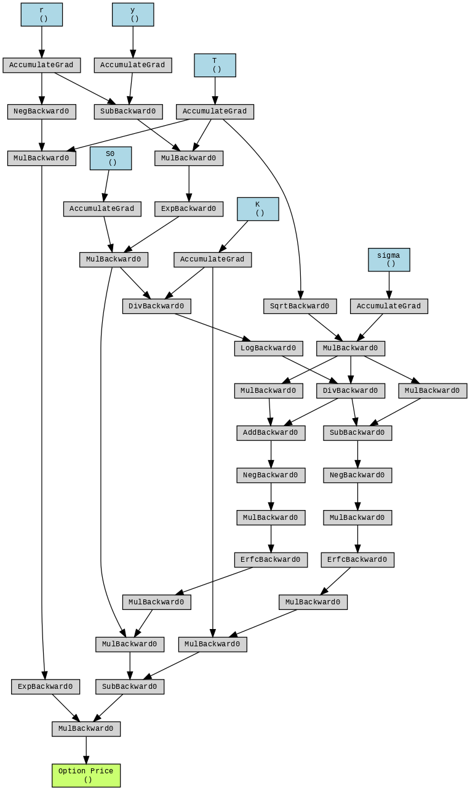

简单介绍下伴随微分(Algorithmic Adjoint Differentiation)在衍生品定价里的应用，对函数$f(x_1,x_2,\dots,x_n)$而言，相较于其他方法，伴随微分方法进行梯度求解的开销至多是函数计算本身的常数倍，与参数维度n 无关，因而在$n$较大时有明显的优势。

以下大部分内容出自Antoine Savine的**[Modern Computational Finance](https://github.com/asavine/CompFinance)**。

### 背景

我们的目的是寻找一种能够快速计算Greeks，也即期权价格对各个要素的偏导数的方法。

以看涨期权为例，看涨期权是一种金融合约，它赋予买方在未来某个特定时间，以约定的价格$K$买入某种资产（如股票）的权利。在无套利和常值波动率假设下，由BS公式，看涨期权的价格可以表示为

$$
C(S_0, r, y, \sigma, K, T) = DF [ F N(d_1) - K N(d_2) ]
$$

其中：
*   $S_0$ ：当前标的资产的价格
*   $r$ ：无风险利率
*   $y$ ：股息率
*   $\sigma$ ：波动率
*   $K$ ：期权的行权价
*   $T$ ：期权的到期时间

计算时需要先求出下面的中间变量：

*   折现因子： $DF = \exp(-rT)$
*   远期价格： $F = S_0 \exp[(r - y)T]$
*   到期收益的标准差： $std = \sigma \sqrt{T}$
*   中间变量：
    $$d = \frac{\log(\frac{F}{K})}{std}, \quad d_1 = d + \frac{std}{2}, \quad d_2 = d - \frac{std}{2}$$

*   $N(d_1)$、$N(d_2)$ 分别是在标准正态分布 $\mathcal N(0,1)$ 下点 $d_1$、$d_2$ 处的累积分布函数值；
*   具体来说，$N$ 定义为
    $$
    N(x) = \int_{-\infty}^{x} \frac{1}{\sqrt{2\pi}} \exp\left(-\frac{u^2}{2}\right)\, \mathrm du
    $$
    即标准正态分布的累积分布函数。

这个式子可以写成如下的纯函数

```python
import math


def normal_cdf(x: float) -> float:
    # Φ(x) = 0.5 * erfc(-x / sqrt(2))
    return 0.5 * math.erfc(-x / math.sqrt(2.0))


def BlackScholes(
    S0: float,
    r: float,
    y: float,
    sigma: float,
    K: float,
    T: float,
) -> float:
    # 1
    df = math.exp(-r * T)
    # 2
    F = S0 * math.exp((r - y) * T)
    # 3
    std = sigma * math.sqrt(T)
    # 4
    d = math.log(F / K) / std
    # 5, 6
    d1 = d + 0.5 * std
    d2 = d1 - std
    # 7, 8
    nd1 = normal_cdf(d1)
    nd2 = normal_cdf(d2)

    # 9
    c = df * (F * nd1 - K * nd2)

    return c
```

根据上式，计算一次看涨期权价格的开销是：两次正态分布运算，两次指数运算，一次开方，十次乘法和除法运算。在实际应用中，一次期权定价不仅需要计算期权的价格，还需要返回价格对各个入参的偏导数。

例如，我们通常所说的Delta是期权价格 ($C$) 相对于标的资产现货价格 ($S_0$) 变动的敏感度，在数学上，它是期权价格对标的资产价格的一阶偏导数：

$$
\Delta = \frac{\partial C}{\partial S_0}
$$

计算偏导数有多种方法，一般而言，期权的价格计算比较复杂，没法写出显式的表达式，因此在一个通用的计算框架里，我们常常用有限差分法计算偏导数，在衍生品定价领域也称Bumping Method。

### 1. 有限差分

回顾导数的定义，导数是下列过程的极限

$$
f'(x) = \lim_{\varepsilon \to 0} \frac{f(x + \varepsilon) - f(x)}{\varepsilon}
$$

我们称该种形式的差分为前向差分，它遵循以下过程：给定其他要素，对某个变量施加微小的扰动$\varepsilon$，分别对函数$f(x+\varepsilon)$与$f(x)$求值，两式相减再除以扰动项$\varepsilon$，即可得到对应输入的偏导数。

将前向差分应用于$S_0$和$\sigma$，有

$$
\frac{\partial C}{\partial S_0} \approx \frac{C(S_0 + \varepsilon, r, y, \sigma, K, T) - C(S_0, r, y, \sigma, K, T)}{\varepsilon}
$$

$$
\frac{\partial C}{\partial \sigma} \approx \frac{C(S_0, r, y, \sigma + \varepsilon, K, T) - C(S_0, r, y, \sigma, K, T)}{\varepsilon}
$$

对香草看涨期权，`BlackScholes`定价函数有6个输入项，在不考虑精度的情况下，用前向差分法计算所有的一阶偏导数需要进行额外的6次`BlackScholes`计算，因此前向差分的计算开销与入参个数呈线性关系。

### 2. 公式法

在一些简单的场景，比如前述的看涨期权，我们可以写出偏导数的闭式解

$$
\begin{aligned}
\frac{\partial C}{\partial S_0} &= \frac{DF \cdot F}{S_0} \cdot N(d_1) \\[8pt]
\frac{\partial C}{\partial r} &= DF \cdot K T \cdot N(d_2) \\[8pt]
\frac{\partial C}{\partial y} &= -DF \cdot F T \cdot N(d_1) \\[8pt]
\frac{\partial C}{\partial \sigma} &= DF \cdot F \cdot n(d_1) \cdot \sqrt{T} \\[8pt]
\frac{\partial C}{\partial K} &= -DF \cdot N(d_2) \\[8pt]
\frac{\partial C}{\partial T} &= DF \cdot F \cdot n(d_1) \cdot \frac{\sigma}{2\sqrt{T}} + r K \cdot DF \cdot N(d_2) - y \cdot DF \cdot F \cdot N(d_1)
\end{aligned}
$$

其中 $n$ 是标准正态分布的概率密度函数：

$$
n(x) = \frac{\partial N(x)}{\partial x} = \frac{1}{\sqrt{2\pi}} \exp \left( -\frac{x^2}{2} \right)
$$

然而，简单的应用公式法并不便宜，注意对每个偏导数的计算，我们仍然需要一次与`BlackScholes`函数相当的开销，并且偏导数计算的次数相对于入参个数仍然是线性的。

以下我们称该种方法为`Naive Formula Method`，因为不难观察到这些偏导数公式中有许多公共的部分，只要经过合理的编排，将公共的子表达式提取出来，计算的开销就能大幅降低。

例如在计算$\frac{\partial C}{\partial S_0}$时，我们可以把$N(d_1)$的结果保存下来，只需额外的几次乘法就可以得到$\frac{\partial C}{\partial y}$；同样的，$N(d_2)$可以在 $\frac{\partial C}{\partial r}$和$\frac{\partial C}{\partial K}$中复用。（这里不太能指望CSE帮助我们）

经过一些努力，我们得到了下面更快的计算方法，我们称为`Clever Formula Method`：

```python
import math
from dataclasses import dataclass


INV_SQRT_2PI: float = 0.39894228040143267794  # 1 / sqrt(2π)


def normal_pdf(x: float) -> float:
    # 标准正态分布的密度函数 n(x)
    return INV_SQRT_2PI * math.exp(-0.5 * x * x)


def normal_cdf(x: float) -> float:
    # 标准正态分布的累积分布函数 N(x)
    # N(x) = 0.5 * erfc(-x / sqrt(2))
    return 0.5 * math.erfc(-x / math.sqrt(2.0))


@dataclass
class BSGreeks:
    price: float   # C
    dS0: float     # ∂C/∂S0
    dr: float      # ∂C/∂r
    dy: float      # ∂C/∂y
    dSigma: float  # ∂C/∂σ
    dK: float      # ∂C/∂K
    dT: float      # ∂C/∂T（相对于剩余到期时间 T 的导数）


def BlackFormula(
    S0: float,     # spot
    r: float,      # risk-free rate
    y: float,      # dividend yield
    sigma: float,  # volatility
    K: float,      # strike
    T: float,      # maturity
) -> BSGreeks:
    DF = math.exp(-r * T)
    F = S0 * math.exp((r - y) * T)
    sqrtT = math.sqrt(T)
    stdDev = sigma * sqrtT
    d = math.log(F / K) / stdDev
    d1 = d + 0.5 * stdDev
    d2 = d - 0.5 * stdDev

    N1 = normal_cdf(d1)
    N2 = normal_cdf(d2)
    n1 = normal_pdf(d1)

    DF_F = DF * F  # DF * F
    DF_K = DF * K  # DF * K

    price = DF * (F * N1 - K * N2)

    dS0 = DF_F / S0 * N1                  # ∂C/∂S0
    dr = DF_K * T * N2                    # ∂C/∂r
    dy = -DF_F * T * N1                   # ∂C/∂y
    dSigma = DF_F * n1 * sqrtT            # ∂C/∂σ
    dK = -DF * N2                         # ∂C/∂K
    dT = (                                # ∂C/∂T（T = time-to-maturity）
        DF_F * n1 * sigma / (2.0 * sqrtT)
        + r * DF_K * N2
        - y * DF_F * N1
    )

    return BSGreeks(
        price=price,
        dS0=dS0,
        dr=dr,
        dy=dy,
        dSigma=dSigma,
        dK=dK,
        dT=dT,
    )
```

问题是，对`Clever Formula Method`来说，计算复杂度该如何分析。要回答这个问题，我们必须弄明白我们是如何提取公共子表达式的。注意到在 BS 模型里，期权价格 $C$ 是远期价格 $F$ 的函数，而 $F$ 是 $S_0$ 和 $y$（以及 $r$ 和 $T$）的函数，由链式法则：

$$
\frac{\partial C}{\partial S_0} = \frac{\partial C}{\partial F} \frac{\partial F}{\partial S_0}, \quad \frac{\partial C}{\partial y} = \frac{\partial C}{\partial F} \frac{\partial F}{\partial y}
$$

在`Clever Formula Method`中，我们看到$\frac{\partial C}{\partial S_0}$和$\frac{\partial C}{\partial y}$的公共子表达式$N(d_1)$，正是$\frac{\partial C}{\partial F}$，这启发了我们如何提取各个表达式中的公共子表达式。


由上图我们看到$S_0$如何影响最终结果$C$，首先它参与$F$的计算，$F$决定了$d$和 $v$的数值，$d$进入$d_1和d_2$，$d_1,d_2$变换到$nd_1,nd_2$，$nd_1,nd_2$传导到$v$，最后是一个恒等映射$C = v$。

$$S_0 \longrightarrow F \longrightarrow \{d, v\} \longrightarrow \{d_1, d_2\} \longrightarrow \{nd_1, nd_2\} \longrightarrow v \xrightarrow{\text{恒等映射}} C$$

为方便描述，我们定义最终结果$C$对变量$x$的导数为$x$的伴随，记作$\overline{x}$。

例如，$S_0$的伴随表示为

$$
\overline{S_0} = \frac{\partial C}{\partial S_0} =\frac{\partial C}{\partial F} \frac{\partial F}{\partial S_0} = \frac{\partial F}{\partial S_0} \overline{F} = \frac{F}{S_0} \overline{F}
$$

注意$F$是$S_0$的函数，而用伴随表示时，$\overline{S_0}$是$\overline{F}$的函数，这是一种普适的关系。

接下来，注意到$F$指向了$d$和$v$，根据链式法则，它的梯度是两条路径的梯度之和。

$$
\begin{aligned}
\overline{F} &= \underbrace{\frac{\partial d}{\partial F} \cdot \overline{d}}_{\text{路径1： via } d} + \underbrace{\frac{\partial v}{\partial F} \cdot \overline{v}}_{\text{路径2： via } v} \\
&= \frac{\overline{d}}{F \cdot std} + DF \cdot nd_1 \cdot \overline{v} \\
&= \frac{\overline{d}}{F \cdot std} + DF \cdot nd_1 \cdot 1
\end{aligned}
$$

$d$分别流向$d_1$和$d_2$，于是

$$
\begin{cases}
d_1 = d + \frac{std}{2} \\
d_2 = d - \frac{std}{2}
\end{cases}
\Rightarrow \overline{d} = \overline{d_1} + \overline{d_2}
$$

$d_1$和$d_2$分别指向$N(d_1)$和$N(d_2)$

$$
\begin{aligned}
nd_1 = N(d_1) &\Rightarrow \overline{d_1} = n(d_1)\overline{nd_1} \\
nd_2 = N(d_2) &\Rightarrow \overline{d_2} = n(d_2)\overline{nd_2}
\end{aligned}
$$

最后我们有

$$
v = DF[F nd_1 - K nd_2] \Rightarrow
\begin{cases}
\overline{nd_1} = DF \cdot F \cdot \overline{v} = DF \cdot F \\
\overline{nd_2} = -DF \cdot K \cdot \overline{v} = -DF \cdot K
\end{cases}
$$

总结如下

$$
\begin{aligned}
\overline{S_0} &= \frac{F}{S_0} \overline{F} \\
&= \frac{F}{S_0} \left( \frac{\overline{d}}{F \cdot std} + DF \cdot nd_1 \right) \\
&= \frac{F}{S_0} \left( \frac{\overline{d_1} + \overline{d_2}}{F \cdot std} + DF \cdot nd_1 \right) \\
&= \frac{F}{S_0} \left( \frac{n(d_1)\overline{nd_1} + n(d_2)\overline{nd_2}}{F \cdot std} + DF \cdot nd_1 \right) \\
&= \frac{F}{S_0} \left( \frac{n(d_1)DF \cdot F - n(d_2)DF \cdot K}{F \cdot std} + DF \cdot nd_1 \right) \\
&= DF \frac{F}{S_0} \left[ N(d_1) + \frac{n(d_1) - \frac{K}{F}n(d_2)}{std} \right] \\
&= \frac{DF \cdot F}{S_0} N(d_1)
\end{aligned}
$$

这里的关键在于，在计算时我们并不直接使用公式$\overline{S_0} = \frac{DF \cdot F}{S_0} N(d_1)$计算偏导数，而遵循如下的顺序

$$
\overline{v} \longrightarrow \{\overline{nd_1}, \overline{nd_2}\} \longrightarrow \{\overline{d_1}, \overline{d_2}\} \longrightarrow \overline{d} \longrightarrow \overline{F} \longrightarrow \overline{S_0}
$$

也即从最终结果的伴随开始，沿着与函数计算相反的顺序进行伴随的求解，最终正好每个变量被计算了一次，这给出了我们合并子表达式的标准过程。

对其他变量的进行相同的处理，最终得到


下面是利用伴随微分法求解 Greeks 的 Python 代码。

```python
def BlackAdjoint(
    S0: float,
    r: float,
    y: float,
    sigma: float,
    K: float,
    T: float,
) -> BSGreeks:
    # --- Forward Pass (Evaluation) ---
    sqrtT = math.sqrt(T)

    discount_factor = math.exp(-r * T)        # DF
    forward = S0 * math.exp((r - y) * T)      # F
    std_dev = sigma * sqrtT                   # σ√T

    d = math.log(forward / K) / std_dev
    d1 = d + 0.5 * std_dev
    d2 = d - 0.5 * std_dev

    N1 = normal_cdf(d1)
    N2 = normal_cdf(d2)

    price = discount_factor * (forward * N1 - K * N2)

    # --- Reverse Pass (Adjoint Calculation) ---
    price_adjoint = 1.0  # seed: ∂price/∂price = 1

    S0_adjoint = 0.0
    r_adjoint = 0.0
    y_adjoint = 0.0
    sigma_adjoint = 0.0
    K_adjoint = 0.0
    T_adjoint = 0.0

    discount_factor_adjoint = price_adjoint * (forward * N1 - K * N2)
    forward_adjoint = price_adjoint * discount_factor * N1
    K_adjoint += price_adjoint * discount_factor * (-N2)
    N1_adjoint = price_adjoint * discount_factor * forward
    N2_adjoint = price_adjoint * discount_factor * (-K)

    d1_adjoint = N1_adjoint * normal_pdf(d1)
    d2_adjoint = N2_adjoint * normal_pdf(d2)

    d_adjoint = d1_adjoint + d2_adjoint
    std_dev_adjoint = 0.5 * d1_adjoint - 0.5 * d2_adjoint

    forward_adjoint += d_adjoint / (forward * std_dev)
    K_adjoint += -d_adjoint / (K * std_dev)
    std_dev_adjoint += -d_adjoint * d / std_dev

    sigma_adjoint += std_dev_adjoint * sqrtT
    T_adjoint += std_dev_adjoint * sigma / (2.0 * sqrtT)

    S0_adjoint += forward_adjoint * (forward / S0)
    r_adjoint += forward_adjoint * (T * forward)
    y_adjoint += forward_adjoint * (-T * forward)
    T_adjoint += forward_adjoint * ((r - y) * forward)

    r_adjoint += discount_factor_adjoint * (-T * discount_factor)
    T_adjoint += discount_factor_adjoint * (-r * discount_factor)

    return BSGreeks(
        price=price,
        dS0=S0_adjoint,
        dr=r_adjoint,
        dy=y_adjoint,
        dSigma=sigma_adjoint,
        dK=K_adjoint,
        dT=T_adjoint,
    )
```
### 自动微分

在之前的求解过程中，我们手动引入了诸如 $DF, F, std$等中间变量，从更一般的视角来看，BlackScholes 公式本质上由加减乘除以及正态分布等基本函数组合而成，将这些更基本的运算视为节点，我们会得到一张更细粒度、包含大量中间变量的计算图。然而随着模型复杂度的增加，手动实现伴随微分变得几乎不可行，此时需要借助自动微分框架：只需编写前向传播的代码，框架会自动构建计算图并跟踪梯度。下面是Pytorch的版本。

```python
import torch
import math
from torchviz import make_dot

INV_SQRT_2 = 1.0 / math.sqrt(2.0)

def BlackTorch(
      S0: float,
      r: float,
      y: float,
      sigma: float,
      K: float,
      T: float,
  ):
    dtype = torch.float64

    S0_t    = torch.tensor(S0,    dtype=dtype, requires_grad=True)
    r_t     = torch.tensor(r,     dtype=dtype, requires_grad=True)
    y_t     = torch.tensor(y,     dtype=dtype, requires_grad=True)
    sigma_t = torch.tensor(sigma, dtype=dtype, requires_grad=True)
    K_t     = torch.tensor(K,     dtype=dtype, requires_grad=True)
    T_t     = torch.tensor(T,     dtype=dtype, requires_grad=True)

    DF      = torch.exp(-r_t * T_t)
    F       = S0_t * torch.exp((r_t - y_t) * T_t)
    sqrtT   = torch.sqrt(T_t)
    std_dev = sigma_t * sqrtT

    d  = torch.log(F / K_t) / std_dev
    d1 = d + 0.5 * std_dev
    d2 = d - 0.5 * std_dev

    N1 = 0.5 * torch.erfc(-d1 * INV_SQRT_2)
    N2 = 0.5 * torch.erfc(-d2 * INV_SQRT_2)

    price = DF * (F * N1 - K_t * N2)
    price.backward()

    return {
        "price":  float(price.item()),
        "dS0":    float(S0_t.grad.item()),    # ∂C/∂S0 
        "dr":     float(r_t.grad.item()),     # ∂C/∂r   
        "dy":     float(y_t.grad.item()),     # ∂C/∂y
        "dSigma": float(sigma_t.grad.item()), # ∂C/∂σ   
        "dK":     float(K_t.grad.item()),     # ∂C/∂K
        "dT":     float(T_t.grad.item()),     # ∂C/∂T   
    }
```
Torch在背后为我们构建了下面的计算图，它完全对应着BS公式，以最左边的一条线为例，`r` 和 `T` 进入 `MulBackward0` ($r \times T$) $\rightarrow$ `NegBackward0` ($-rT$) $\rightarrow$ `ExpBackward0` ($e^{-rT}$)，诸如此类。



### 复杂度分析
现在我们可以正式的来分析伴随微分方法的复杂度，以下限定在$\odot \in \{+, \cdot, /\}$ 的域$K$上讨论，设 $F(x_1, ..., x_n)$ 是变量为 $x_1, ..., x_n \in K$ 的有理函数

**定义** 称计算 $F$ 的运算序列 $\{g_1, ..., g_s\}$ 是一个**直线程序（straight-line programs，简称SLP）**，如果每个 $g_i$ 都属于以下形式之一：  
(1) $g_i \leftarrow g_j \odot g_k$，其中 $j, k < i$；  
(2) $g_i \leftarrow g_j \odot c$，其中 $j < i$ 且 $c \in K$；  
(3) $g_i \leftarrow x_k \odot x_l$；  
(4) $g_i \leftarrow x_k \odot c$，其中 $c \in K$；或  
(5) $g_i \leftarrow g_j \odot x_k$，其中 $j < i$。  

规定运算序列的最后一项$g_s$ 给出 $F(x_1, ..., x_n)$的结果。

举例来说，函数 $F(x_1, x_2, x_3) = 5 - x_1 x_2^2 / x_3$可由以下运算序列计算：

$$
\begin{aligned}
g_1 &\leftarrow x_2 \cdot x_2 \\
g_2 &\leftarrow x_1 \cdot g_1 \\
g_3 &\leftarrow g_2 / x_3 \\
g_4 &\leftarrow -1 \cdot g_3 \\
g_5 &\leftarrow 5 + g_4
\end{aligned}
$$

那么$\{g_1,g_2,g_3,g_4,g_5\}$就是一个计算 $F$ 的 SLP，显然 SLP 并不唯一，我们定义 $T(F)$是计算$F$的最短$SLP$的长度，即

$$
T(F) = \min_{\Gamma} \{ s \mid \Gamma = (g_1, \dots, g_s) \text{ computes } F \}
$$

如前所述，有限差分法（Finite Difference）的复杂度与入参的个数$x_1,x_2,...x_n$成正比，它的算数复杂度可以表示为

$$
T_{\text{fd}}(\nabla F(x_1, \dots, x_n)) \in O\left( n \cdot T(F(x_1, \dots, x_n)) \right)
$$

下面我们将证明，应用伴随微分法计算导数时，其计算复杂度与输入维度 $n$ 无关。事实上，Baur-Strassen 定理给出了如下估计：

**Theorem (Baur-Strassen):**

$$
T(\nabla F(x_1, \dots, x_n)) \leq 6 \cdot T(F)
$$

其中 $T(F)$ 表示计算函数 $F$ 的最小算术运算次数。

证明:


假设 $\{g_1, \dots, g_s\}$ 是计算 $F(x_1, \dots, x_n)$ 的最短 SLP，定义 $F^{(i)}$ 为由 $g_i, \dots, g_s$ 计算的函数。

以之前的 SLP 为例
$$
\begin{aligned}
g_1 &\leftarrow x_2 \cdot x_2 \\
g_2 &\leftarrow x_1 \cdot g_1 \\
g_3 &\leftarrow g_2 / x_3 \\
g_4 &\leftarrow -1 \cdot g_3 \\
g_5 &\leftarrow 5 + g_4
\end{aligned}
$$

对应着函数

$$ F(x_1, x_2, x_3) = 5 - \frac{x_1 x_2^2}{x_3} $$

$F^{(i)}$ 理解为：前 $i-1$ 步已经计算完成，由剩下的步骤所组成的函数。

当$i=1$，运算还未开始，
$$F^{(1)}(x_1,x_2,x_3) = F = 5 - \frac{x_1 x_2^2}{x_3}$$

当$i=3$，$g_1$ [$x_2^2$] 和 $g_2$ [$x_1 g_1$] 已经计算完成，他们的计算结果变为已知量，则$F^{(3)}$的输入变为$\{x_1, x_2, x_3, g_1, g_2\}$，剩余的步骤是$\{g_3, g_4, g_5\}$

$$ F^{(3)}(x_1, x_2, x_3, g_1, g_2) = 5 - \frac{g_2}{x_3} $$

当$i=5$，运算序列只差最后一步加法
$$
F^{(5)}(x_1, x_2, x_3, g_1, g_2, g_3, g_4) = 5 + g_4
$$

当$i=6$，所有的计算已经完成，$F^{(6)}$是恒等映射：
$$
F^{(6)}(x_1, x_2, x_3, g_1, g_2, g_3, g_4, g_5) = g_5
$$

一般的，$F^{(i)}$的变量集合为 $\{x_1, \dots, x_n, g_1, \dots, g_{i-1}\}$，为了便于说明，我们将变量重命名为 $\{z_1, \dots, z_{n+s}\}$，当 $j \leq n$ 时 $z_j = x_j$，当 $j > n$ 时 $z_j = g_{j-n}$。

证明的思路是归纳法，假设 $F^{(i+1)}$ 的导数可以由至多 $5(s - i)$ 次运算计算完成，需要证明至多 $5(s - i + 1)$ 次运算可以计算出 $F^{(i)}$ 的所有导数。

**Base case：** $i = s$。  

当$i = s$， $F^{(i+1)} = F^{(s+1)}(x_1, \dots, x_n, g_1, \dots, g_s) = g_s$是恒等映射，于是，

$$
\frac{\partial F^{(s+1)}}{\partial z_j} =
\begin{cases}
1, & \text{if } z_j = g_s \\
0, & \text{if } z_j \neq g_s
\end{cases}
$$

这需要 0 次运算。

**Induction：**  
假设我们用至多 $5(s - i)$ 次运算计算出了所有的$\frac{\partial F^{(i+1)}}{\partial z_j}$，需要证明额外的 5 次运算可以计算出所有的 $\frac{\partial F^{(i)}}{\partial z_j}$。

注意到$F^{(i)}$ 可通过$F^{(i+1)}$和$g_i$计算得到，具体来说，假设 $g_i = s_b \odot s_\ell$，则：

$$
F^{(i)}(z_1, \dots, z_{n+i-1}) = F^{(i+1)}(z_1, \dots, z_{n+i-1}, \underbrace{s_b \odot s_\ell}_{g_i})
$$

应用链式法则：
$$
\frac{\partial F^{(i)}}{\partial z_j} = \frac{\partial F^{(i+1)}}{\partial z_j} + \frac{\partial F^{(i+1)}}{\partial g_i} \cdot \frac{\partial g_i}{\partial z_j}
$$

由于 $g_i$ 的定义仅涉及 $s_b$ 和 $s_\ell$，我们只需更新与操作数 $s_b$ 和 $s_\ell$ 相关的导数项：

$$
\frac{\partial F^{(i)}}{\partial s_k} = \frac{\partial F^{(i+1)}}{\partial s_k} + \frac{\partial F^{(i+1)}}{\partial g_i} \cdot \frac{\partial g_i}{\partial s_k}, \quad \text{for } k \in \{b, \ell\}
$$

接下来分情况讨论即可

**case 1：** $g_i = z_t + z_{t'}$  
此时
$$
\begin{aligned}
\frac{\partial F^{(i)}}{\partial z_t} &= \frac{\partial F^{(i+1)}}{\partial z_t} + \frac{\partial F^{(i+1)}}{\partial g_i} \\
\frac{\partial F^{(i)}}{\partial z_{t'}} &= \frac{\partial F^{(i+1)}}{\partial z_{t'}} + \frac{\partial F^{(i+1)}}{\partial g_i}
\end{aligned}
$$
由于我们假设$F^{(i+1)}$的导数都已计算完成，这两个导数的更新分别只需 1 次加法运算，总共 **2 次运算**。

**case 2：** $g_i = z_t \cdot z_{t'}$

$$
\begin{aligned}
\frac{\partial F^{(i)}}{\partial z_t} &= \frac{\partial F^{(i+1)}}{\partial z_t} + \frac{\partial F^{(i+1)}}{\partial g_i} \cdot z_{t'} \\
\frac{\partial F^{(i)}}{\partial z_{t'}} &= \frac{\partial F^{(i+1)}}{\partial z_{t'}} + \frac{\partial F^{(i+1)}}{\partial g_i} \cdot z_t
\end{aligned}
$$
每个梯度的更新需要 2 次运算（1 次乘法，1 次加法），总计 **4 次运算**。

**case 3：** $g_i = z_t / z_{t'}$
$$
\begin{aligned}
\frac{\partial F^{(i)}}{\partial z_t} &= \frac{\partial F^{(i+1)}}{\partial z_t} + \frac{\partial F^{(i+1)}}{\partial g_i} / z_{t'} \\
\frac{\partial F^{(i)}}{\partial z_{t'}} &= \frac{\partial F^{(i+1)}}{\partial z_{t'}} + \frac{\partial F^{(i+1)}}{\partial g_i} \cdot \left( \frac{-z_t}{z_{t'}^2} \right)
\end{aligned}
$$

这是最为复杂的情况，我们可以通过如下步骤更新梯度

1. $a \leftarrow \frac{\partial F^{(i+1)}}{\partial g_i} / z_{t'}$
2. $b \leftarrow a \cdot (-1)$
3. $c \leftarrow b \cdot g_i$
4. $\frac{\partial F^{(i)}}{\partial z_t} + a$
5. $\frac{\partial F^{(i)}}{\partial z_{t'}} + c$

总计**5 次运算**。
这三种情况也覆盖了 $s_b$ 或 $s_\ell$ 是标量的情况，证明就此完成。

### 性能测试

在同一组参数下进行 1,000,000 次定价计算，测试环境使用单线程 `-O3` 编译优化，参数如下：
> $S_0 = 100, r = 1\%, y = 0, \sigma = 20\%, K = 100, T = 1$

不同方法的测试结果如下表所示：

| 方法名称 | 耗时 (1M次) | 相对前向计算倍数 |
| :--- | :--- | :--- |
| **Finite Difference** | ~ 222.8 ms | ≈ 10.5 × |
| **Naive Formulas Method**  | ~ 188.2 ms | ≈ 8.9 × |
| **Adjoint Differentiation** | ~ 54.5 ms | ≈ 2.6 × |
| **Clever Formula Method** | ~ 48.1 ms | ≈ 2.3 × |

这个场景中有6个参数，伴随微分方法相较于有限差分方法快了4倍，比理论分析还要快，这是因为$Baur-Strassen$定理仅考虑了加减乘除等基本运算，对于更复杂的函数$e^x$，伴随微分方法的优势更为明显，因为它只需在前向计算时将结果保存下来。随着参数的增加，有限差分方法和伴随微分方法的差距会进一步拉开。另一边，我们手动提取公共子表达式的`Clever Formula Method`比伴随微分方法还要略快，因为`Clever Formula Method`利用 BS 模型的数学特性进行了更多的优化，并且可以更彻底的减少重复运算，但大多时候，我们甚至无法找到一个闭式解，只能用有限元或者蒙特卡洛等数值方法求解，在数值求解时应用自动微分是实际应用中最主要的场景。

### 伴随微分与蒙特卡洛

考虑一个参数化的随机变量族 $(P(\theta))_{\theta\in\Theta}$，其中 $\theta$ 是衍生证券的特定参数，$\Theta \subset \mathbb{R}$ 是一个区间，$P(\theta)$ 是衍生证券的支付函数（payoff function）。定义

$$ V(\theta) := \mathbb{E}[P(\theta)]$$

为特定衍生证券的价格 [6]。

这一节我们关注只能对$V(\theta)$进行估计的情况，根据强大数定律，如果 $P_1, P_2, \dots, P_N$ 是独立同分布（i.i.d.）的随机变量样本，样本均值是期望的无偏估计

$$ \hat{V}(\theta) = \frac{1}{N} \sum_{n=1}^N P_n(\theta) $$

$$ \frac{1}{N} \sum_{n=1}^N P_n(\theta) \xrightarrow{N\to\infty} \mathbb{E}[P(\theta)] = V(\theta) $$

有关蒙特卡洛方法的直观介绍，请参考 [Scratchapixel: Monte Carlo Methods in Practice](https://www.scratchapixel.com/lessons/mathematics-physics-for-computer-graphics/monte-carlo-methods-in-practice/monte-carlo-methods.html)。

现在让我们考虑如何估计$\dot{V}$ 或 $\partial_\theta V$，通常这时候只能用有限差分
$$ \hat{\dot{V}}(\theta) \approx \frac{\hat{V}(\theta + \epsilon) - \hat{V}(\theta)}{\epsilon} $$

但如果支付函数足够平滑，我们可以交换极限符号

$$ \dot{V}(\theta) = \frac{\partial}{\partial \theta} \mathbb{E}[P(\theta)] = \mathbb{E}\left[ \frac{\partial P(\theta)}{\partial \theta} \right] $$

定义 $\dot{P}(\theta) := \frac{\partial P(\theta)}{\partial \theta}$ 为单个路径中支付函数对参数的导数，那么 $\dot{V}(\theta)$ 的估计量为：

$$ \hat{\dot{V}}(\theta) = \frac{1}{N} \sum_{n=1}^N \dot{P}_n(\theta) $$

以看涨期权为例，它的支付函数为
$$
P(S_T) = \max(S_T - K, \, 0) 
$$

根据风险中性定价原理，期权价格是其未来收益的期望值：

$$ V = e^{-rT} \mathbb{E}^Q [ \max(S_T - K, 0) ] $$

利用蒙特卡洛方法求解该期望值的步骤大致如下

#### 第一步：生成随机样本
我们需要模拟 $N$ 条路径，首先生成 $N$ 个服从标准正态分布的随机数：
$$ Z_1, Z_2, \dots, Z_N \sim \mathcal{N}(0, 1) $$

#### 第二步：计算到期资产价格 ($S_T$)
计算每一条路径在 $T$ 时刻的资产价格

$$ S_T^{(n)} = S_0 \cdot \exp\left( \left( r - y - \frac{1}{2}\sigma^2 \right)T + \sigma \sqrt{T} Z_n \right) $$
其中 $n = 1, \dots, N$。

#### 第三步：计算期权支付 (Payoff)
对于每一条路径，计算期权到期时的赔付。对于看涨期权：

$$ P_n = \max(S_T^{(n)} - K, \, 0) $$

*(如果 $S_T^{(n)} < K$，则该路径的期权价值为 0)*

#### 第四步：求平均
将所有路径的支付取算术平均，折现回当前时刻（乘以 $e^{-rT}$）：

$$ \hat{V} = e^{-rT} \left( \frac{1}{N} \sum_{n=1}^N P_n \right) $$

```python
import numpy as np


def BlackFiniteDifferenceMC(
    S0: float,
    r: float,
    y: float,
    sigma: float,
    K: float,
    T: float,
    num_sims: int = 100000,
    seed: int = 12345,
    epsilon: float = 1e-4,
):
    """
    使用前向差分 (Forward Difference) 计算价格和 Greeks。
   （1 + 6 = 7 次定价）。
    """
    # 1. 固定随机种子并生成公共随机数 (Common Random Numbers)
    rng = np.random.default_rng(seed)
    Z = rng.standard_normal(num_sims)

    # 定义内部定价核函数（不在此处改变 Z）
    def pricing_kernel(S0: float, r: float, y: float, sigma: float, K: float, T: float) -> float:
        drift = (r - y - 0.5 * sigma**2) * T
        diffusion = sigma * np.sqrt(T) * Z
        ST = S0 * np.exp(drift + diffusion)
        payoff = np.maximum(ST - K, 0.0)
        discount_factor = np.exp(-r * T)
        return discount_factor * np.mean(payoff)

    # 2. 计算基准价格 (Base Price)
    base_price = pricing_kernel(S0, r, y, sigma, K, T)

    # 3. 前向差分计算 Greeks: (Price_bumped - Base_Price) / bump_size

    # --- Delta (dS0)：使用相对扰动 ---
    S0_bump = max(abs(S0) * epsilon, epsilon)
    price_S0_up = pricing_kernel(S0 + S0_bump, r, y, sigma, K, T)
    dS0 = (price_S0_up - base_price) / S0_bump

    # --- Rho (dr) ---
    r_bump = epsilon
    price_r_up = pricing_kernel(S0, r + r_bump, y, sigma, K, T)
    dr = (price_r_up - base_price) / r_bump

    # --- Div Rho (dy) ---
    y_bump = epsilon
    price_y_up = pricing_kernel(S0, r, y + y_bump, sigma, K, T)
    dy = (price_y_up - base_price) / y_bump

    # --- Vega (dSigma) ---
    sigma_bump = epsilon
    price_sigma_up = pricing_kernel(S0, r, y, sigma + sigma_bump, K, T)
    dSigma = (price_sigma_up - base_price) / sigma_bump

    # --- Strike Delta (dK) ---
    K_bump = max(abs(K) * epsilon, epsilon)
    price_K_up = pricing_kernel(S0, r, y, sigma, K + K_bump, T)
    dK = (price_K_up - base_price) / K_bump

    # --- Theta (dT) ---
    T_bump = max(abs(T) * epsilon, epsilon)
    price_T_up = pricing_kernel(S0, r, y, sigma, K, T + T_bump)
    dT = (price_T_up - base_price) / T_bump

    return {
        "price": base_price,
        "dS0": dS0,
        "dr": dr,
        "dy": dy,
        "dSigma": dSigma,
        "dK": dK,
        "dT": dT,
    }
```

以下是自动微分的版本，只是把定价核从 NumPy 换到了 PyTorch。

```python
import torch


def BlackAdjointDifferenceMC(
    S0: float,
    r: float,
    y: float,
    sigma: float,
    K: float,
    T: float,
    num_sims: int = 100000,
    seed: int = 12345,
):
    dtype = torch.float64

    # 1. 将所有标量参数转换为 Tensor，并开启梯度追踪
    S0_t = torch.tensor(S0, dtype=dtype, requires_grad=True)
    r_t = torch.tensor(r, dtype=dtype, requires_grad=True)
    y_t = torch.tensor(y, dtype=dtype, requires_grad=True)
    sigma_t = torch.tensor(sigma, dtype=dtype, requires_grad=True)
    K_t = torch.tensor(K, dtype=dtype, requires_grad=True)
    T_t = torch.tensor(T, dtype=dtype, requires_grad=True)

    # 2. 生成标准正态分布随机数 (Z)，不参与计算图的导数传播
    torch.manual_seed(seed)
    Z = torch.randn(num_sims, dtype=dtype)

    # 3. 前向传播：构建计算图 (Computational Graph)
    # 漂移项: (r - y - 0.5 * sigma^2) * T
    drift = (r_t - y_t - 0.5 * sigma_t**2) * T_t

    # 扩散项: sigma * sqrt(T) * Z
    diffusion = sigma_t * torch.sqrt(T_t) * Z

    # 计算到期价格 S_T
    ST = S0_t * torch.exp(drift + diffusion)

    # 计算支付 Payoff: max(S_T - K, 0)
    # torch.relu 在前向传播中等价于 max(x, 0)
    payoff = torch.relu(ST - K_t)

    # 折现并求期望: e^(-rT) * E[Payoff]
    DF = torch.exp(-r_t * T_t)
    price = DF * torch.mean(payoff)

    # 4. 反向传播：自动计算所有梯度
    price.backward()

    # 5. 提取结果
    return {
        "price": float(price.item()),
        "dS0": float(S0_t.grad.item()),     # Delta
        "dr": float(r_t.grad.item()),       # Rho
        "dy": float(y_t.grad.item()),       # Div Rho
        "dSigma": float(sigma_t.grad.item()),  # Vega
        "dK": float(K_t.grad.item()),       # Dual Delta (Strike Delta)
        "dT": float(T_t.grad.item()),       # -Theta
    }
```
